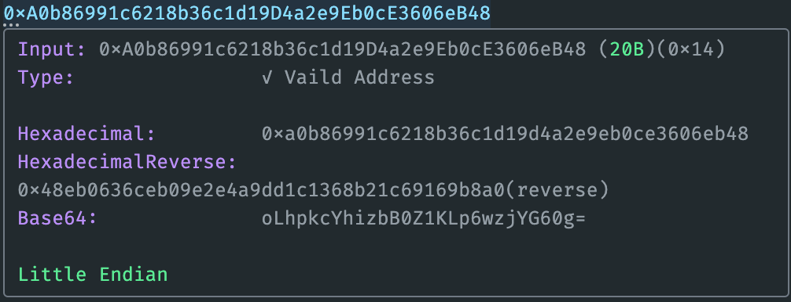
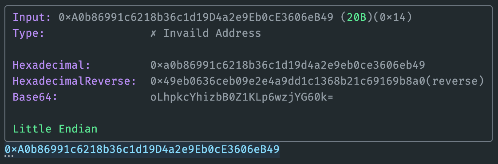
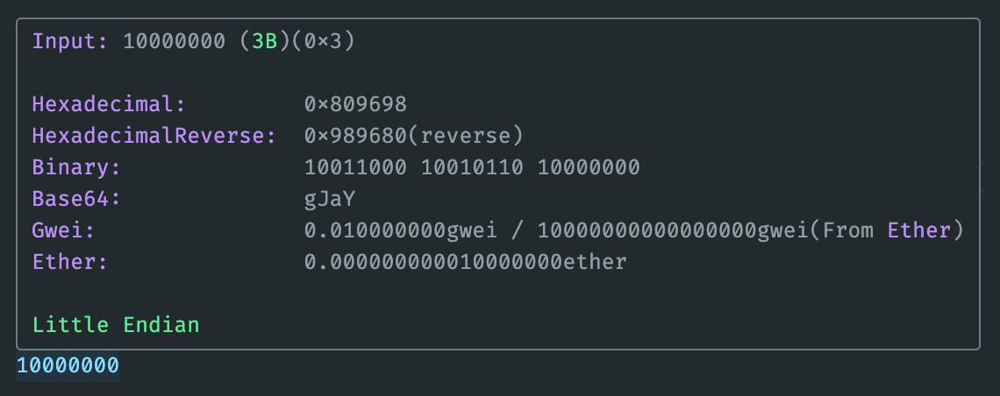
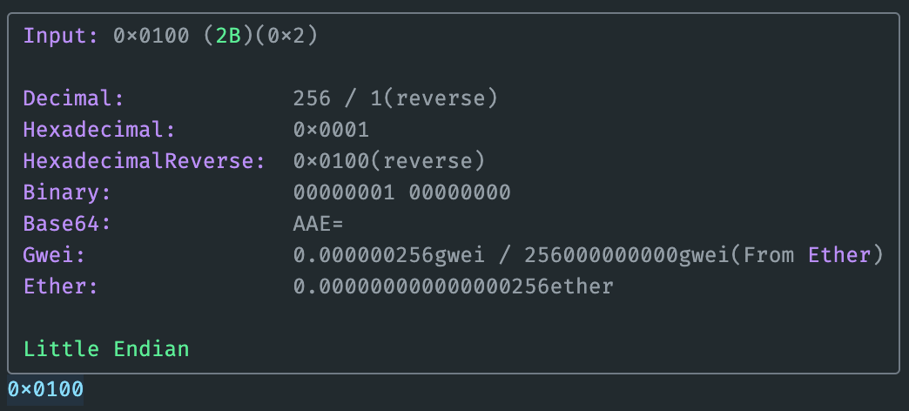
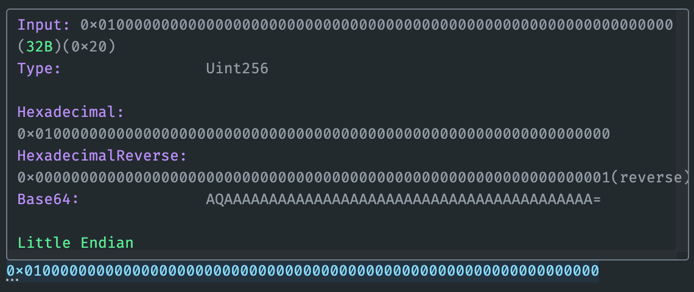

# Ethereum Inspector
This plugin provides a series of auxiliary tools for checking EVM addresses, amounts, and various numerical conversions. It supports both big-endian and little-endian formats and can be used on non-EVM chains. You can customize the display items (see the feature tab).

## Overview
features:

- Identify and verify Ethereum addresses
- uint256 length prompt
- Automatic conversion between wei/gwei/ether
- Hex/decimal/binary conversion
- Base64 conversion
- Common blockchain explorer links [planned]
- Balance check [planned]
- Contract check [planned]

## Screenshot
### CheckSum
vaild address
  

invaild address
  

### calc gwei and ether
  

### parse hex number
  

### tip uint256
  
